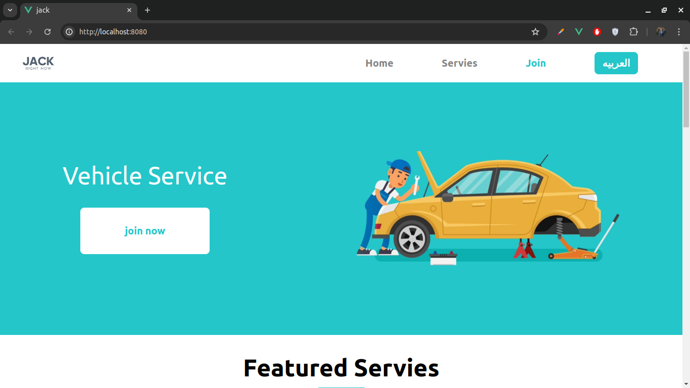
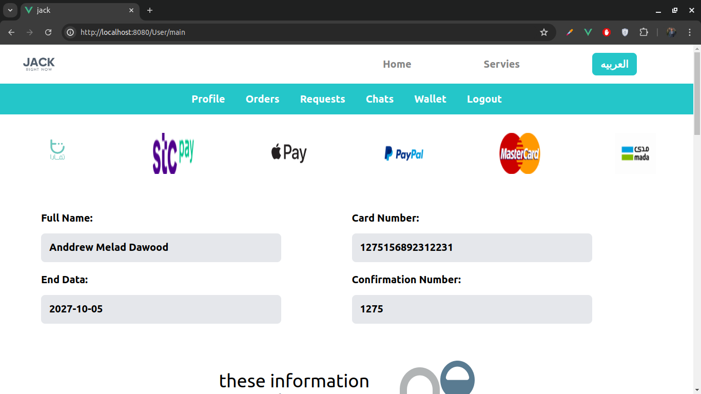
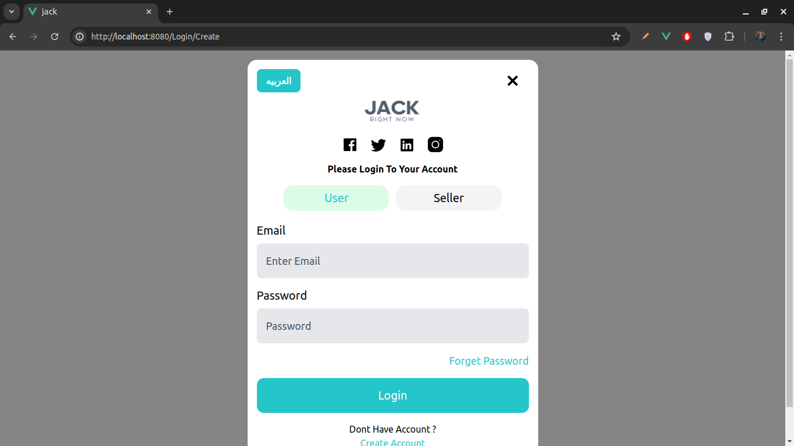
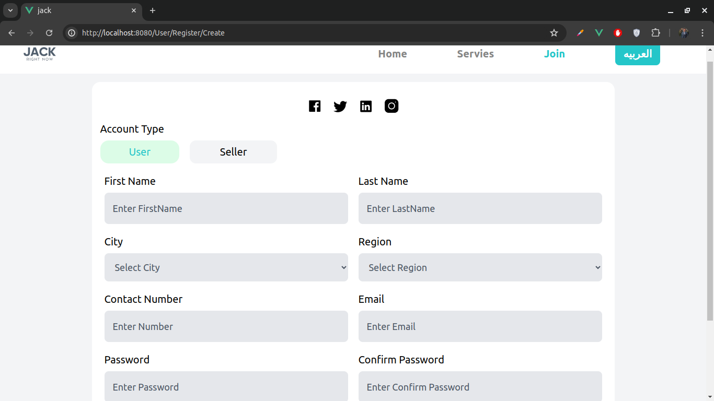
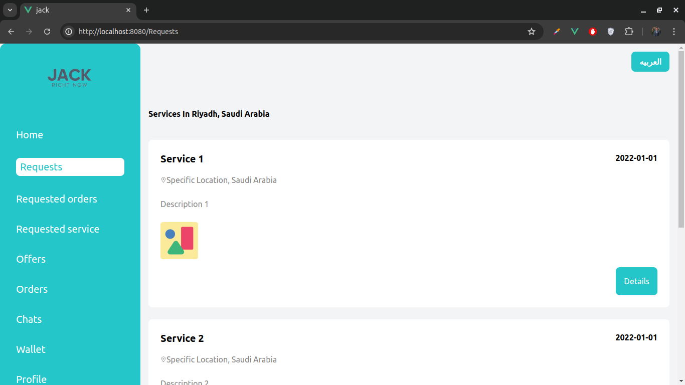

# Jack

A project aimed at offering car repair services, parts purchase, and selling old or damaged cars.

## Features

- Car repair services
- Parts purchase
- Selling old or damaged cars
- Multiple user roles: admin and customer
- Web responsive design

## Images







## Installation

Follow these steps to run the project locally:

1. Clone the repository:
   ```sh
   git clone <repository-url>
   cd project-folder
   ```
